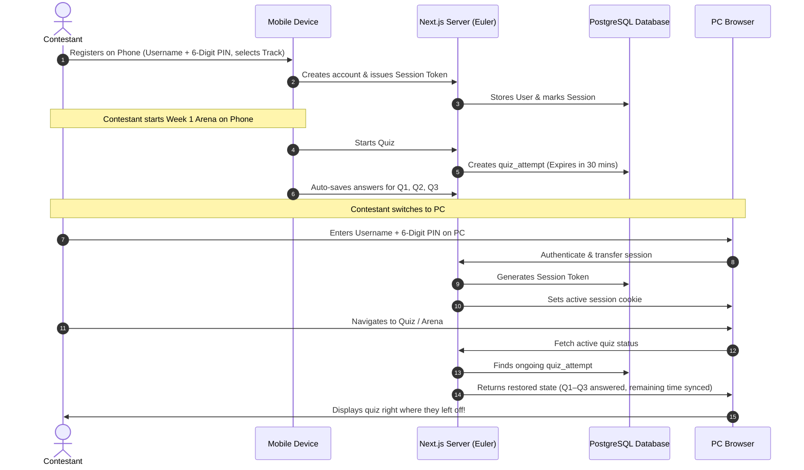
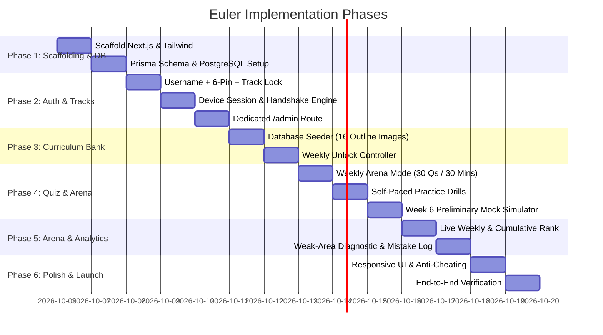

# Implementation Plan: Euler
### Competitive Quiz & Exam Preparation Platform for Huawei ICT Competition 2026–2027

---

## 1. Executive Summary & Architecture Overview
* **Application Name:** **Euler**
* **Target Audience:** Southern Africa contestants preparing for the Huawei ICT Competition 2026–2027 across the **Cloud**, **Computing**, and **Network** tracks.
* **Tech Stack:**
  - **Framework:** Next.js 14+ (App Router, Server Actions, Route Handlers)
  - **Styling:** Tailwind CSS + Shadcn-style components + Lucide Icons + Framer Motion animations
  - **Database & ORM:** PostgreSQL (Neon / Supabase / Native Windows service — **Zero Docker**) with Prisma ORM
  - **Authentication:** Custom session token + UUID device binding (Username + 6-digit PIN)
  - **Admin Access:** Dedicated `/admin` route secured by environment master key (`ADMIN_PIN`)

---

## 2. Key Architecture Decisions

### 2.1 Zero-Docker Database Setup
* **No Docker requirement:** Euler connects directly to PostgreSQL via standard URI connection string (`DATABASE_URL="postgresql://..."`).
* Developers and contestants can point `.env.local` to:
  - Free serverless cloud PostgreSQL (e.g., Neon.tech, Supabase)
  - Or a local PostgreSQL service running natively on Windows.

### 2.2 Cross-Device Handover (Mobile Phone $\rightarrow$ PC)
To allow a contestant to register on a smartphone and seamlessly transition to a PC (or vice versa):
1. **Server-Authoritative State:**
   - Every active quiz attempt (`started_at`, `expires_at`, current score, selected answers) is saved in PostgreSQL in real time.
2. **Device Handshake & Active Session Transfer:**
   - When the user logs in from their PC using their Username + 6-digit PIN, the server generates a new session token for the PC and updates `active_session_token` in the database.
   - The phone session is superseded. If the phone browser is still open, it displays a gentle notification: *"Your session is now active on another device"*.
3. **Restoring Ongoing Quizzes:**
   - If the user switches devices while taking a 30-minute weekly arena quiz, the PC retrieves the active attempt.
   - The timer does **not** reset (it calculates remaining time using `expires_at - server_now()`).
   - All previously selected answers are restored so the student continues without disruption.

---

## 3. Phased Implementation Roadmap

### Phase 1: Workspace Scaffolding & PostgreSQL Integration
* Initialize Next.js 14+ project (`app` router, TypeScript, Tailwind CSS).
* Configure Lucide icons, Canvas Confetti, and Shadcn-compatible UI helpers.
* Set up Prisma ORM with PostgreSQL client.
* Configure `.env.local` with `DATABASE_URL` (direct PostgreSQL connection).
* Deploy schema migrations:
  - `User` (username, pin_hash, track, role)
  - `DeviceSession` (user_id, device_uuid, session_token, is_active)
  - `TrackWeek` (track, week_number, title, is_unlocked)
  - `Question` & `QuestionOption` (type, text, explanation, domain, topic)
  - `QuizAttempt` & `UserAnswer` (score, time_taken, is_official)
  - `Bookmark` (starred questions)

### Phase 2: Authentication, Track Isolation & Device Session Handover
* **Contestant Signup / Login Form:**
  - Username input (clean alphanumeric validation).
  - 6-digit numeric PIN input (obscured pin keypad or standard input).
  - PIN encrypted with `bcryptjs`.
* **Track Selection & Lock:**
  - On first sign-in: prompt choice between **Network**, **Cloud**, and **Computing**.
  - Track is permanently stored in user record; users cannot access other track materials.
* **Cross-Device Handover Engine:**
  - Client sends `device_uuid` + session token.
  - Logging in on a new device automatically invalidates the old device token while retaining all quiz records.
* **Admin Portal:**
  - Dedicated `/admin` route requiring `ADMIN_PIN`.
  - Global dashboard to oversee all tracks, inspect contestants, and unlock weekly modules.

### Phase 3: Curriculum Question Bank & Seeder Engine
* Extract all domains and topics from the 16 screenshots into a clean, typed seed dataset (`prisma/seed.ts`):
  - **Cloud:** Cloud Evolution, IAM, ECS, BMS, VPC, OBS, RDS, GeminiDB, CCE/K8s, ModelArts, AI basics, LLM/RAG, Pangu models.
  - **Computing:** openEuler CLI, Bash, Vim, System management, openGauss deployment & SQL, Kunpeng DevKit porting, BoostKit.
  - **Network:** VRP, TCP/IP, Ethernet switching, VLAN, STP, OSPF, IPv6, WAN PPP, Firewalls, IPsec/SSL VPN, DCN basics, WLAN CAPWAP/roaming.
* Set initial unlock state:
  - Week 1: Unlocked by default for all tracks.
  - Weeks 2–5 and Week 6 Mock: Locked by default, togglable by Admin.

### Phase 4: Core Quiz Engine & Game Modes

#### Mode 1: Weekly Competitive Arena
* 30 questions in 30 minutes.
* Strict **one official attempt** per student per unlocked week.
* Server-side countdown validation.
* Background auto-save for every answered question to ensure 0 data loss.
* Auto-submission upon timer expiry.
* Instant update of the Weekly Track Leaderboard.

#### Mode 2: Self-Paced Practice Drills
* Unlimited attempts for any unlocked week's syllabus topics.
* Instant feedback: reveals correct answer, in-depth explanation, and Huawei documentation citations.
* Filter by specific topic or domain.

#### Mode 3: Week 6 Preliminary Mock Exam Simulator
* Exact replica of official Huawei Preliminary rules:
  - 60 questions, 60 minutes countdown.
  - 1,000 points total score (600 passing threshold).
  - Questions strictly weighted according to official exam outlines.
  - Single-choice, multiple-choice (all-or-nothing scoring), and true/false questions.

#### Mode 4: Mistake Notebook & Bookmarks
* System automatically saves every question answered incorrectly.
* Contestants can filter and re-test specifically against their past mistakes.
* Quick star/bookmark button on any question during practice or review.

### Phase 5: Competitive Leaderboards & Performance Diagnostics
* **Live Leaderboards:**
  - **Weekly Leaderboard:** Filtered by track and week number. Ranked by `score DESC`, tie-broken by `time_taken_seconds ASC`.
  - **Season Cumulative Leaderboard:** Sum of official weekly arena scores across the competition period.
  - Top 3 podium display (Gold, Silver, Bronze badges).
* **Weak Area Diagnostic Radar:**
  - Visual mastery breakdown by domain (e.g., Datacom: 85%, DCN: 50%, Security: 78%, WLAN: 92%).

### Phase 6: UI Polish, Anti-Cheating & Launch
* Mobile-responsive layout optimized for both smartphones and PCs.
* Option randomization (shuffles choice order per attempt to discourage memorization).
* Blur / tab-switch detection warnings during official arena mode.
* Confetti celebration cards on quiz completion.

---

## 4. Verification Plan

### 4.1 Automated Checks
1. Database schema generation and migration via Prisma.
2. Seed validation test to verify question counts and correct answers across all tracks.
3. Unit tests for scoring logic (especially all-or-nothing multiple-choice grading).

### 4.2 Manual Verification Walkthrough
1. **Registration & Track Lock:**
   - Register user `jordan`, PIN `112233`, select `COMPUTING`.
   - Confirm only openEuler, openGauss, and Kunpeng modules appear.
2. **Cross-Device Handover Test:**
   - Log in as `jordan` on Browser 1 (simulating phone) and start Week 1 Practice Drill.
   - Answer 3 questions.
   - Open Browser 2 (simulating PC), log in as `jordan`.
   - Confirm session in Browser 2 is active and user answers are preserved.
3. **Arena Attempt Guard:**
   - Take the Week 1 Arena quiz and submit.
   - Confirm rank on Week 1 Leaderboard.
   - Attempt to start Week 1 Arena again $\rightarrow$ verify blocked with "Already Completed" notice.
4. **Admin Unlock:**
   - Access `/admin`, enter Admin PIN, unlock Week 2.
   - Verify Week 2 is immediately accessible on the student dashboard.
